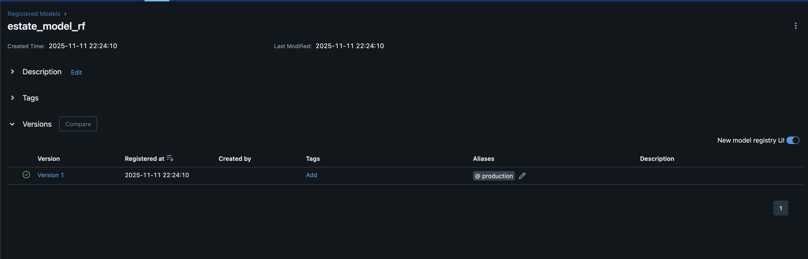
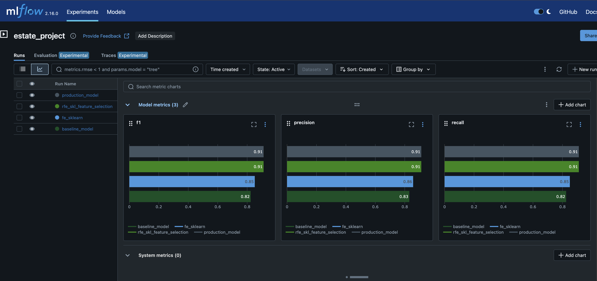

# Классификация цен на мобильные телефоны

## Описание проекта

Проект посвящён решению задачи классификации цен на мобильные телефоны. С имеющимся датасетом было проведено полноценное исследование, включающее разведочный анализ данных (EDA) и создание моделей машинного обучения.

**Исходные данные:** https://www.kaggle.com/datasets/iabhishekofficial/mobile-price-classification

## Запуск

Для запуска проекта необходимо выполнить следующие команды:

```bash
# Клонирование репозитория
git clone https://github.com/vadsavina/iislabs.git

# Переход в директорию проекта
cd iislabs

# Активация виртуального окружения
source .iislabs/bin/activate

# Установка зависимостей
pip install -r requirements.txt

# Запуск Jupyter Notebook
jupyter notebook
```

После запуска откройте файл `eda/eda.ipynb` или `research/research.ipynb` в браузере.

**Примечание:** Исходные данные (`train.csv`, `test.csv`) должны находиться в папке `./data`

### Запуск MLflow

Для отслеживания экспериментов с моделями используется MLflow.

**Шаги:**

1. Перейти в директорию mlflow:
   ```bash
   cd mlflow
   ```

2. Выполнить в терминале следующую команду:
   ```bash
   source start_mlflow.sh
   ```

3. MLflow UI будет доступен по адресу: **http://127.0.0.1:5001**

**Примечание:** MLflow должен быть запущен перед выполнением экспериментов в `research/research.ipynb`

## Исследование данных

Разведочный анализ данных находится в файле `./eda/eda.ipynb`

### Выполненные преобразования данных

В ходе исследования были проведены следующие действия по оптимизации и очистке данных:

1. **Оптимизация памяти:**
   - Бинарные признаки (наличие/отсутствие функций) переведены в категориальный тип:
     ```python
     df['blue'] = df['blue'].astype('category')
     df['wifi'] = df['wifi'].astype('category')
     ```
   - Числовые признаки с небольшим диапазоном значений оптимизированы:
     ```python
     df['fc'] = df['fc'].astype('int8')
     df['ram'] = df['ram'].astype('int16')
     ```
   - Дробные значения переведены в формат `float16` для экономии памяти
   - **Результат:** использование памяти снижено с 328 KB до 114 KB (~65% экономии)

2. **Очистка данных:**
   - Удалены записи с аномально малой высотой разрешения экрана:
     ```python
     df = df.query('px_height >= 20')
     ```
   - Удалены записи с аномально малой шириной экрана:
     ```python
     df = df.query('sc_w >= 3')
     ```

### Выявленные закономерности

В ходе анализа были обнаружены следующие важные зависимости:

1. **Зависимость характеристик от ценового диапазона** (график `graph1_characteristics_vs_price_range.png`)
   
   Среди всех числовых характеристик наиболее сильную прямую корреляцию с ценой демонстрируют:
   - **Емкость аккумулятора** (battery_power) - устройства в высоком ценовом сегменте имеют батареи большей ёмкости
   - **Оперативная память** (RAM) - чётко выраженная линейная зависимость: чем выше ценовая категория, тем больше RAM
   - **Внутренняя память** (int_memory) - также растёт с увеличением цены, хотя корреляция менее выражена
   - **Фронтальная камера** (fc) - качество фронтальной камеры имеет слабо выраженную корреляцию с ценой
   

2. **Зависимость размеров экрана от цены** (график `graph2_screen_size_vs_price_range.png`)
   
   Установлена прямая зависимость между размерами дисплея и ценовой категорией:
   - Как физические размеры экрана (высота и ширина в см), так и разрешение (в пикселях) увеличиваются с ростом цены
   - Более дорогие устройства имеют большие экраны с более высоким разрешением
   - Зависимость разрешения более выражена, чем зависимость физических размеров
   

3. **Влияние функциональных возможностей на время разговора** (график `graph5_talk_time_vs_features.png`)
   
   Анализ показал интересную закономерность:
   - Наличие **WiFi** и **4G** коррелирует с *меньшим* временем разговора, что объясняется повышенным энергопотреблением этих модулей
   - Наличие **Bluetooth** и **сенсорного экрана** показывает *увеличение* времени разговора, что может свидетельствовать о том, что эти функции внедрялись вместе с общим улучшением энергоэффективности устройств
   

4. **Влияние толщины устройства** (график `graph4_characteristics_vs_thickness.png`)
   
   С увеличением толщины телефона наблюдается:
   - Незначительное увеличение веса устройства
   - Небольшой рост ёмкости батареи (больше места для батареи)
   - Слабая положительная корреляция с качеством основной камеры и количеством ядер процессора
   - Объяснение: большая толщина позволяет разместить более производительные компоненты
   

5. **Интерактивный анализ ключевых параметров** (график `graph3_price_vs_cores_ram.html`)
   
   Создан интерактивный график, который позволяет детально исследовать зависимость между:
   - Количеством процессорных ядер
   - Объёмом оперативной памяти
   - Ценовой категорией устройства
   - Ёмкостью батареи
   
   График позволяет выявить кластеры устройств в разных ценовых сегментах и подтверждает, что RAM является одним из ключевых факторов, определяющих ценовую категорию телефона.

### Сохранённые артефакты

Все графики сохранены в папке `./eda/`:
- `graph1_characteristics_vs_price_range.png` - основные характеристики vs цена
- `graph2_screen_size_vs_price_range.png` - параметры экрана vs цена
- `graph3_price_vs_cores_ram.html` - интерактивная визуализация (Bokeh)
- `graph4_characteristics_vs_thickness.png` - зависимость от толщины
- `graph5_talk_time_vs_features.png` - время разговора vs функции

Очищенный датасет сохранён в файле `./data/clean_data.pkl`

---

## Разработка и настройка моделей

Исследование моделей машинного обучения находится в файле `./research/research.ipynb`

### Проведённые эксперименты

В ходе исследования было проведено несколько экспериментов по улучшению качества модели:

1. **Baseline модель**
   - Алгоритм: RandomForestClassifier с параметрами по умолчанию
   - Preprocessing: StandardScaler для числовых признаков, TargetEncoder для категориальных
   - Метрики: precision, recall, f1-score

2. **Feature Engineering (sklearn)**
   - Добавлены полиномиальные признаки (PolynomialFeatures, degree=2) для `m_dep` и `battery_power`
   - Применён QuantileTransformer для всех числовых признаков
   - Использован SplineTransformer для признака `px_height`
   - Результат: расширенный набор признаков, улучшение метрик

3. **Feature Selection (RFE)**
   - Использован алгоритм Recursive Feature Elimination (RFE) из sklearn
   - Отобрано 12 наиболее важных признаков из расширенного набора
   - Результат: упрощение модели при сохранении качества

4. **Feature Selection (SequentialFeatureSelector)**
   - Использован SequentialFeatureSelector из mlxtend с forward selection
   - Сравнение различных стратегий отбора признаков
   - Результат: идентифицированы ключевые признаки

5. **Оптимизация гиперпараметров (Optuna & GridSearchCV)**
   - Настройка параметров RandomForestClassifier:
     - `n_estimators`: количество деревьев
     - `max_depth`: максимальная глубина
     - `max_features`: доля признаков для построения дерева
   - Метрика оптимизации: f1-score
   - Результат: подобраны оптимальные гиперпараметры

### Результаты исследования

Лучший результат показала модель на основе **sklearn RFE** (Recursive Feature Elimination):

**Параметры модели:**
- В качестве средства оценки: **RandomForestClassifier**
- Количество отобранных признаков: **12**
- Шаг отбора (step): **0.2**

**Метрики лучшего прогона:**
- **Precision:** 0.9248
- **Recall:** 0.9250
- **F1-score:** 0.9248
- **Run ID:** `00e2896da20a49c0b8550c616efb28bd`

**Отобранные признаки:**
Список ключевых признаков сохранён в файле `./research/rfe_skl_cols.txt`

---

**Production модель:**
- **Run ID в MLflow:** `c712bbdc90bf489d8e80f24390a4c4c4`
- **Модель зарегистрирована как:** `estate_model_rf`
- **Статус:** Production
- Модель обучена на тренировочной выборке (X_train, y_train)
- Валидация на тестовой выборке (X_test, y_test)

**Метрики Production модели:**
- **Precision:** 0.9125
- **Recall:** 0.9111
- **F1-score:** 0.9116

### Скриншоты экспериментов





---

## Сервис классификации

Для развертывания модели production создан REST API сервис на базе FastAPI, упакованный в контейнер.

### Описание файлов в папке `services`

**services/ml_service/**
- `api_handler.py` — включает в себя функции, необходимые для работы модели в FastAPI (загрузка, обработка и предсказание)
- `main.py` — содержит основные функции для создания предсказаний через REST API
- `requirements.txt` — содержит необходимые для работы сервиса библиотеки
- `Dockerfile` — включает в себя необходимые команды для сборки контейнера с определёнными параметрами

**services/models/**
- `get_model.py` — берёт модель с алиасом `production` из MLflow и записывает её в формат pickle
- `model.pkl` — содержит модель, полученную в предыдущем пункте (генерируется автоматически)

### Подготовка модели

Перед запуском сервиса необходимо загрузить модель из MLflow:

```bash
# Убедитесь, что MLflow запущен на порту 5001
cd mlflow
source start_mlflow.sh

# В другом терминале загрузите модель
cd services/models
python get_model.py
```

Модель будет сохранена в файл `services/models/model.pkl`

### Создание образа и запуск контейнера

Контейнеризация осуществляется с помощью Podman (приоритетнее Docker из-за лицензирования):

```bash
cd services/ml_service

# Сборка образа
podman build . --tag mobile_classifier_model:1

# Запуск контейнера
podman run -p 8000:8000 -v $(pwd)/../models:/models:z mobile_classifier_model:1
```

**Для Docker (альтернатива):**
```bash
docker build . --tag mobile_classifier_model:1
docker run -p 8000:8000 -v $(pwd)/../models:/models mobile_classifier_model:1
```

После запуска контейнера сервис будет доступен по адресу http://localhost:8000

**3. Интерактивная документация API (Swagger UI):**

Откройте в браузере: http://localhost:8000/docs

Swagger UI позволяет протестировать все endpoints в удобном интерфейсе.

### API Endpoints

- `GET /` — проверка доступности сервиса
- `POST /api/prediction` — предсказание ценового диапазона мобильного телефона
  - **Параметры запроса:**
    - `mobile_id` (int) — идентификатор устройства
  - **Тело запроса (JSON):** характеристики телефона
  - **Ответ:** `mobile_id` и предсказанный `price_range`

---

## Мониторинг

В рамках данного раздела был налажен веб-интерфейс Prometheus, существующий для сбора и хранения метрик, генерируемых сервисами. Файл конфигурации хранится в директории `services/prometheus/`. Доступ к веб-интерфейсу осуществляется по адресу http://localhost:9090.

### Собираемые метрики

1. **model_predictions** (histogram) — гистограмма предсказаний модели по ценовым диапазонам
2. **http_requests_total** (counter) — общее количество HTTP запросов с разбивкой по методу, статусу и handler
3. **http_request_duration_seconds** (histogram) — длительность HTTP запросов

### Конфигурация Prometheus

Файл `services/prometheus/prometheus.yml` содержит настройки scraping метрик:
- Интервал сбора метрик: 15 секунд
- Target: ML сервис на порту 8000
- Job name: `ml_service`

---

## Дашборд

В рамках завершающего этапа был разработан сервис Grafana.


Сервис создан для визуализации метрик путём создания дашбордов. Полученный в результате создания дашборд хранится в `services/grafana/dashboard.json`. Веб-интерфейс запускается по адресу http://localhost:3000. В качестве database используется сервис Prometheus.

### Состав дашборда

Дашборд **"Mobile Price Classification Monitoring"** включает следующие панели:

1. **Model Predictions Distribution** — гистограмма распределения предсказаний модели по ценовым диапазонам
2. **Request Rate (per minute)** — частота запросов к сервису в минуту
3. **HTTP Errors** — отображение ошибок 4xx и 5xx
4. **Request Latency** — латентность запросов (95-й и 99-й перцентили)
5. **Total Requests** — общее количество обработанных запросов

### Доступ к Grafana

- **URL:** http://localhost:3000
- **Логин:** admin
- **Пароль:** admin

---

## Запуск проекта

Для развертывания всех сервисов (ML сервис, Prometheus, Grafana, генератор запросов) используется Docker Compose или Podman Compose.

### Предварительные требования

1. Убедитесь, что модель загружена:
```bash
cd services/models
source ../../.iislabs/bin/activate
python get_model.py
```

### Запуск с Podman Compose (рекомендуется)

```bash
cd services

# Сборка образов
podman compose build

# Запуск всех сервисов
podman compose up -d

# Проверка статуса
podman compose ps

# Просмотр логов
podman compose logs -f

# Остановка сервисов
podman compose down
```

### Запуск с Docker Compose

```bash
cd services

# Сборка образов
docker compose build

# Запуск всех сервисов
docker compose up -d

# Проверка статуса
docker compose ps

# Просмотр логов
docker compose logs -f

# Остановка сервисов
docker compose down
```

### Доступные сервисы после запуска

| Сервис | URL | Описание |
|--------|-----|----------|
| ML Service | http://localhost:8000 | REST API для предсказаний |
| Swagger UI | http://localhost:8000/docs | Интерактивная документация API |
| Prometheus | http://localhost:9090 | Веб-интерфейс Prometheus |
| Grafana | http://localhost:3000 | Дашборд визуализации метрик |

---
